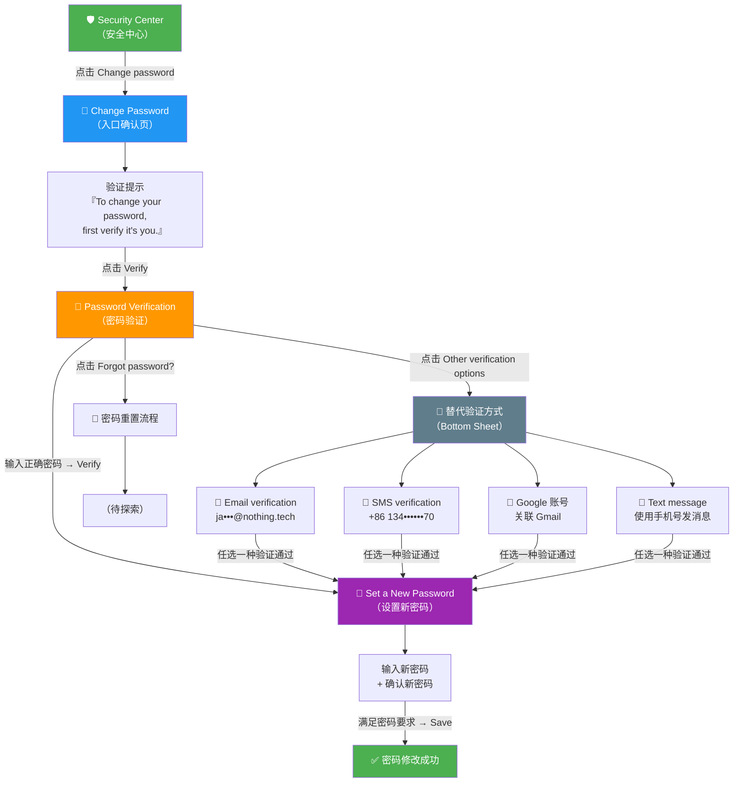

# 一加账号 (OnePlus Account) — 更改密码 功能流程分析

> **竞品分析报告** | 2026-06-23 | 设备: OnePlus 9 Pro (LE2123)

---

## 一、功能流程图



---

## 二、逐页截图与设计分析

### 步骤 1：Security Center（安全中心）


| 属性 | 内容 |
|------|------|
| 页面标题 | Security Center |
| 安全状态 | ✅ Your account is protected |
| 所属 App | com.oneplus.account |

**页面结构：**
```
Security Center
├── 🔒 安全状态卡片（"Your account is protected"）
├── Change password        → 修改密码
├── Trusted devices        → 2 台可信设备
├── 2-Step Verification    → 未开启
└── Backup email address   → 0 个备用邮箱
```

**设计要点：**
- 顶部安全状态卡片（绿色盾牌图标），一眼可知安全状态
- Change password 排在第一优先级
- 每项含标题 + 描述文字 + 右侧箭头指示
- 工具栏仅有返回按钮 + 不可用的 Next 按钮

---

### 步骤 2：Change Password 入口


| 属性 | 内容 |
|------|------|
| 页面标题 | Change password |
| 核心文案 | To change your password, first verify it's you. |
| CTA | Verify 按钮 |

**设计要点：**
- 🔑 钥匙图标 + 明确的预期管理文案
- 单 CTA 页面，降低认知负担
- 告知用户下一步：身份验证
- 蓝色主按钮，视觉聚焦

---

### 步骤 3：Password Verification（密码验证）


| 属性 | 内容 |
|------|------|
| 标题 | Password verification |
| 账号标识 | +86 134****70（手机号脱敏） |
| 输入字段 | 当前密码（password masked） |

**页面元素：**
```
Password verification
├── 账号描述：Enter the password for your OnePlus Account +86 134****70
├── 密码输入框（支持 Show/Hide password）
├── Forgot password? 链接
├── Verify 按钮（密码为空时禁用）
└── Other verification options 按钮
```

**设计要点：**
- 账号信息脱敏展示，帮助用户确认操作对象
- Show/Hide password 切换按钮（ToggleButton）
- 三条路径出口：Verify / Forgot password? / Other verification options
- Verify 按钮输入后启用，防止空提交

---

### 步骤 4：Other Verification Options（替代验证）


| 属性 | 内容 |
|------|------|
| 类型 | Bottom Sheet 弹出面板 |
| 选项数 | 4 种替代验证 |

| # | 方式 | 脱敏标识 |
|---|------|---------|
| 1 | 📧 **Email verification** | ja•••@nothing.tech |
| 2 | 📱 **SMS verification** | +86 134••••••70 |
| 3 | 🔵 **Google 账号** | 关联 Gmail |
| 4 | 💬 **Text message** | 使用 134••••••70 发消息 |

**设计要点：**
- Bottom Sheet 模式，当前页面不跳转
- 4 种替代验证覆盖：邮箱 / 短信 / 第三方 OAuth / RCS/即时通讯
- 全链路脱敏（邮箱、手机号、Google 账号都做模糊处理）
- Cancel 按钮可关闭面板

---

### 步骤 5：Set a New Password（设置新密码）


| 属性 | 内容 |
|------|------|
| 标题 | Set a new password |
| 字段数 | 2 个（新密码 + 确认密码） |
| CTA | Save 按钮 |

**密码强度规则：**
> *Password must be at least 8 characters long and contain at least 3 of the following character types: uppercase letters, lowercase letters, numbers, and symbols.*

**规则解读：**
- 最少 **8 位**字符
- 以下 4 种类型中至少满足 **3 种**：
  - A-Z 大写字母
  - a-z 小写字母
  - 0-9 数字
  - 特殊符号

**示例合规密码：** `NewPass123!`（大写+小写+数字+符号 = 4/4 满足）

**设计要点：**
- 双字段确认机制，防止输入错误
- 密码规则明文展示在输入区上方
- 两个字段各自有 Show/Hide password 切换
- Save 按钮字段为空时禁用

---

## 三、竞品对比

| 维度 | 一加账号 | Google Account | Apple ID | 小米账号 |
|------|---------|---------------|----------|---------|
| 验证方式数 | **4 种**（密码/邮箱/短信/Google） | 2FA + 设备推送 | 设备密码 + 2FA | 短信验证码 |
| 密码规则 | ≥8位 + 4选3类型 | ≥8位 + 混合字符 | ≥8位 + 混合字符 | ≥8位 + 字母数字 |
| 脱敏展示 | ✅ 全链路脱敏 | ✅ | ✅ | ⚠️ 部分 |
| 替代验证 | ✅ Bottom Sheet（4种） | 多设备确认 | 受信设备 | 短信为主 |
| Forgot Password | ✅ 独立入口 | ✅ 完整重置链 | ✅ iforgot.apple.com | ✅ |
| UI 风格 | 简洁列表 + BottomSheet | Material Design | iOS 原生 | MIUI 卡片式 |

---

## 四、交互路径总结

```
入口：Security Center → Change password（1 次点击）

主路径（3 步）：
  Change password 入口 → Password Verification → Set a New Password → 完成

分支路径：
  ├── 忘记密码：Password Verification → Forgot password?
  └── 替代验证：Password Verification → Other verification options
                  ├── Email verification
                  ├── SMS verification
                  ├── Google 账号
                  └── Text message
```

**核心特点：** 一加账号的改密流程设计简洁，身份验证支持多种渠道，全链路信息脱敏，Bottom Sheet 交互优雅不打断用户流程。

---

> 截图文件目录: [screenshots/OnePlus/更改密码/](screenshots/OnePlus/更改密码/)
