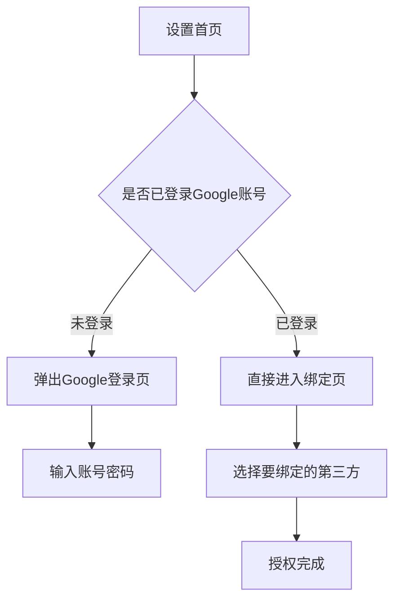

# Claude Code 竞品分析 Prompt 模板集

以下是一套可直接在 Claude Code 中使用的 Prompt 模板。使用时将 `{占位符}` 替换为实际内容。

---

## 模板一：单竞品分析（日常使用）

```
我正在做海外手机系统账号的竞品分析。

## 背景
- 产品方向：海外手机系统账号
- 本次分析能力：{功能名称，如"第三方账号绑定"}
- 目标竞品：{竞品名称，如"谷歌账号"}
- 竞品分类：{系统账号类 / 海外C端账号类}

## 截图说明
以下是按照操作顺序排列的截图。请分析：

[此处粘贴截图，按操作顺序排列]

## 分析要求

### 1. 路径还原
还原完整的操作路径，用箭头链式表示：
例：设置 → 账号 → Google账号 → 关联账号 → 添加第三方账号

### 2. 分流程详细说明

对每个截图，说明：
- 这是哪个步骤
- 页面上的关键元素
- 用户的可能的操作选择
- 分类到以下阶段之一：
  - **入口**：如何发现/进入该功能
  - **开启**：如何启用该能力
  - **关闭**：是否可以关闭，如何关闭
  - **使用**：已开启后如何触发使用
  - **分支**：是否有不同分支场景

### 3. 分支场景梳理

如果有分支场景，请说明：
- 分支触发条件（如：已登录 vs 未登录）
- 分支 A 的完整路径和处理方式
- 分支 B 的完整路径和处理方式
- 每个分支对应的截图编号

### 4. 流程图

用 Mermaid flowchart 语法画出该竞品的完整流程，必须包含所有分支。

格式示例：


### 5. 小结
- 该竞品的亮点（体验好的地方）
- 该竞品的痛点（体验差的地方）
- 和我们产品的差异
```

---

## 模板二：全量对比报告（版本收尾用）

```
我正在做海外手机系统账号的竞品分析，现在所有竞品已经分析完毕，请帮我生成综合对比报告。

## 背景
- 分析能力：{功能名称，如"邮箱注册"}
- 分析日期：{日期}

## 各竞品分析结果

以下是各竞品的单独分析（请基于汇总信息生成对比）：

{粘贴每个竞品的分析结果，或者列出各竞品的核心要点}

## 输出要求

### 一、功能对比总表

生成以下 Markdown 表格：

| 对比维度 | Google | Apple | OPPO | 华为 | 小米 | vivo | Trip.com | Instagram | RedNote | WeChat |
|----------|--------|-------|------|------|------|------|----------|-----------|---------|--------|
| 入口路径 | | | | | | | | | | |
| 是否支持关闭 | | | | | | | | | | |
| 注册登录门槛 | | | | | | | | | | |
| 分支场景数 | | | | | | | | | | |
| 隐私设置粒度 | | | | | | | | | | |
| 异常处理方式 | | | | | | | | | | |
| 最大亮点 | | | | | | | | | | |
| 最大痛点 | | | | | | | | | | |

### 二、横向对比总结

#### 系统账号类的共性做法
1.
2.
3.

#### C端账号类的共性做法
1.
2.
3.

#### 两类分析的差异点
| 维度 | 系统账号类 | C端账号类 |
|------|-----------|----------|
| | | |

### 三、设计建议

#### 推荐产品设计
- 能力描述：
- 推荐流程：


#### 设计理由
1. 对标来源：对标了 {竞品X} 的 {做法}，因为……
2. 对标来源：对标了 {竞品Y} 的 {做法}，因为……
3. 创新点：……

#### 与竞品的差异化
| 差异化点 | 说明 |
|----------|------|
| | |

### 四、结论

用一段话总结核心建议。
```

---

## 模板三：快速截图整理（体验中即时使用）

```
以下是 {竞品名称} 的 {功能名称} 操作截图。

截图顺序就是我操作的顺序，请帮我整理：

1. 给每张截图生成一个描述性的文件名
2. 按分支路径把截图分组
3. 标注每组的路径说明
4. 标注分支条件和跳转关系

截图如下：
[粘贴截图]
```

---

## 模板四：从截图文件夹快速生成分析

```
请分析 {竞品名称} 的「{功能名称}」功能。

## 操作说明
我的操作路径是：
{简要描述操作过程：例如"设置→账号→注册→输入已注册邮箱→看到报错提示"}

## 截图

[把截图文件夹里的图按顺序粘贴到这里]

## 请输出

### 路径还原
用 → 箭头的链式路径

### 分步骤截图说明
| 步骤 | 截图 | 说明 | 分支归属 |
|------|------|------|----------|
| 1 | | | |
| 2 | | | |

### 分支场景
- **分支A**（条件：×××）：图1→图2→图3
- **分支B**（条件：×××）：图1→图4→图5

### 流程图（Mermaid）


### 体验总结（3句话以内）
```

---

## 使用建议

### 日常节奏

```
每个竞品体验时 → 用「模板三」快速整理截图
              → 截图少时直接在当前对话整理

每个竞品体验完 → 用「模板一」生成该竞品的完整分析

该功能全部竞品分析完 → 用「模板二」生成对比报告
```

### Claude Project 设置

建议在 Claude Project（Project Knowledge）中预设以下内容：

```markdown
# 项目背景

我是海外手机系统账号的产品经理。我们产品需要对标的竞品分为两类：

## 系统账号类（6个）
1. 谷歌账号 (Google Account)
2. 苹果账号 (Apple ID / iCloud)
3. OPPO系统账号 (HeyTap)
4. 华为账号 (Huawei ID)
5. 小米账号 (Xiaomi Account)
6. vivo账号 (vivo Account)

## 海外C端账号类（4个）
1. Trip.com
2. Instagram
3. RedNote (小红书国际版)
4. WeChat (微信)

## 分析维度

每次竞品分析覆盖以下维度：
- 入口路径：从哪里进入该功能
- 开启流程：如何开启
- 关闭流程：是否支持关闭、如何关闭
- 使用流程：开启后如何触发使用
- 分支场景：不同条件下的分支路径及处理方式
- 异常处理：错误状态的处理方式

## 输出格式

- 路径用 → 箭头链式表示
- 流程图用 Mermaid flowchart 语法
- 对比表用 Markdown 表格
- 所有分析用中文输出
```
